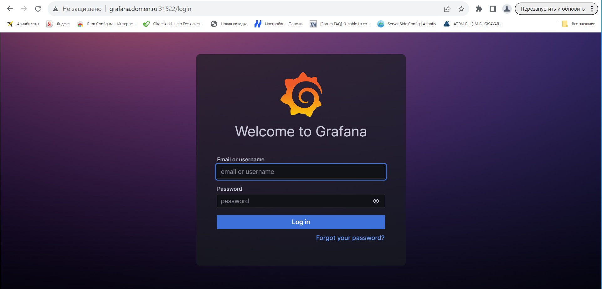

# Дипломный практикум в Yandex.Cloud
  * [Цели:](#цели)
  * [Этапы выполнения:](#этапы-выполнения)
     * [Создание облачной инфраструктуры](#создание-облачной-инфраструктуры)
     * [Создание Kubernetes кластера](#создание-kubernetes-кластера)
     * [Создание тестового приложения](#создание-тестового-приложения)
     * [Подготовка cистемы мониторинга и деплой приложения](#подготовка-cистемы-мониторинга-и-деплой-приложения)
     * [Установка и настройка CI/CD](#установка-и-настройка-cicd)
  * [Что необходимо для сдачи задания?](#что-необходимо-для-сдачи-задания)
  * [Как правильно задавать вопросы дипломному руководителю?](#как-правильно-задавать-вопросы-дипломному-руководителю)

**Перед началом работы над дипломным заданием изучите [Инструкция по экономии облачных ресурсов](https://github.com/netology-code/devops-materials/blob/master/cloudwork.MD).**

---
## Цели:

1. Подготовить облачную инфраструктуру на базе облачного провайдера Яндекс.Облако.
2. Запустить и сконфигурировать Kubernetes кластер.
3. Установить и настроить систему мониторинга.
4. Настроить и автоматизировать сборку тестового приложения с использованием Docker-контейнеров.
5. Настроить CI для автоматической сборки и тестирования.
6. Настроить CD для автоматического развёртывания приложения.

---
## Этапы выполнения:


### Создание облачной инфраструктуры

Для начала необходимо подготовить облачную инфраструктуру в ЯО при помощи [Terraform](https://www.terraform.io/).

Особенности выполнения:

- Бюджет купона ограничен, что следует иметь в виду при проектировании инфраструктуры и использовании ресурсов;
Для облачного k8s используйте региональный мастер(неотказоустойчивый). Для self-hosted k8s минимизируйте ресурсы ВМ и долю ЦПУ. В обоих вариантах используйте прерываемые ВМ для worker nodes.
- Следует использовать версию [Terraform](https://www.terraform.io/) не старше 1.5.x .

Предварительная подготовка к установке и запуску Kubernetes кластера.

1. Создайте сервисный аккаунт, который будет в дальнейшем использоваться Terraform для работы с инфраструктурой с необходимыми и достаточными правами. Не стоит использовать права суперпользователя

Создал сервисный аккаунт.
```
yc iam key create --service-account-id ajec9424efcbsco9cjl9 --output key.json
id: ajeq1vccnvmbpkeogb27
service_account_id: ajec9424efcbsco9cjl9
created_at: "2023-10-19T12:58:37.377382352Z"
key_algorithm: RSA_2048

```

2. Подготовьте [backend](https://www.terraform.io/docs/language/settings/backends/index.html) для Terraform:  
   а. Рекомендуемый вариант: S3 bucket в созданном ЯО аккаунте(создание бакета через TF)
   б. Альтернативный вариант:  [Terraform Cloud](https://app.terraform.io/)

Создал конфигурацию.
Конфиг: [terraform](terraform/)
```
В папке 1bucket.
terraform init
terraform apply
erraform used the selected providers to generate the following execution plan. Resource actions are indicated with the following symbols:
  + create
 <= read (data resources)

Terraform will perform the following actions:

  # data.template_file.provider will be read during apply
  # (config refers to values not yet known)
 <= data "template_file" "provider" {
      + id       = (known after apply)
      + rendered = (known after apply)
      + template = <<-EOT
            terraform {
              required_providers {
                yandex = {
                  source  = "yandex-cloud/yandex"
                  version = "0.78.2"
                }
              }
              backend "s3" {
                endpoint   = "storage.yandexcloud.net"
                bucket     = "dimploma-bucket"
                region     = "ru-central1"
                key        = "terraform.tfstate"
                access_key = "${access_key}"
                secret_key = "${secret_key}"

                skip_region_validation      = true
                skip_credentials_validation = true
              }
            }

            provider "yandex" {
              service_account_key_file = "key.json"
              cloud_id                 = var.yandex_cloud_id
              folder_id                = var.yandex_folder_id
              zone                     = var.yandex_compute_default_zone
            }
        EOT
      + vars     = {
          + "access_key" = (known after apply)
          + "secret_key" = (sensitive value)
        }
    }

  # null_resource.provider will be created
  + resource "null_resource" "provider" {
      + id       = (known after apply)
      + triggers = {
          + "template" = (known after apply)
        }
    }

  # yandex_iam_service_account.bucket-operator will be created
  + resource "yandex_iam_service_account" "bucket-operator" {
      + created_at = (known after apply)
      + folder_id  = "b1gd02p4ii36h57v2h14"
      + id         = (known after apply)
      + name       = "bucket-operator"
    }

  # yandex_iam_service_account_static_access_key.bucket-operator will be created
  + resource "yandex_iam_service_account_static_access_key" "bucket-operator" {
      + access_key           = (known after apply)
      + created_at           = (known after apply)
      + description          = "static access key for object storage"
      + encrypted_secret_key = (known after apply)
      + id                   = (known after apply)
      + key_fingerprint      = (known after apply)
      + secret_key           = (sensitive value)
      + service_account_id   = (known after apply)
    }

  # yandex_resourcemanager_folder_iam_member.editor will be created
  + resource "yandex_resourcemanager_folder_iam_member" "editor" {
      + folder_id = "b1gd02p4ii36h57v2h14"
      + id        = (known after apply)
      + member    = (known after apply)
      + role      = "editor"
    }

  # yandex_resourcemanager_folder_iam_member.viewer will be created
  + resource "yandex_resourcemanager_folder_iam_member" "viewer" {
      + folder_id = "b1gd02p4ii36h57v2h14"
      + id        = (known after apply)
      + member    = (known after apply)
      + role      = "viewer"
    }

  # yandex_storage_bucket.bucket will be created
  + resource "yandex_storage_bucket" "bucket" {
      + access_key            = (known after apply)
      + acl                   = "private"
      + bucket                = "dimploma-bucket"
      + bucket_domain_name    = (known after apply)
      + default_storage_class = (known after apply)
      + folder_id             = (known after apply)
      + force_destroy         = false
      + id                    = (known after apply)
      + secret_key            = (sensitive value)
      + website_domain        = (known after apply)
      + website_endpoint      = (known after apply)

      + anonymous_access_flags {
          + list = false
          + read = false
        }
    }

Plan: 6 to add, 0 to change, 0 to destroy.

Do you want to perform these actions?
  Terraform will perform the actions described above.
  Only 'yes' will be accepted to approve.

  Enter a value: yes

yandex_iam_service_account.bucket-operator: Creating...
yandex_iam_service_account.bucket-operator: Creation complete after 3s [id=aje6indu47gf5s6qre61]
yandex_resourcemanager_folder_iam_member.editor: Creating...
yandex_iam_service_account_static_access_key.bucket-operator: Creating...
yandex_resourcemanager_folder_iam_member.viewer: Creating...
yandex_iam_service_account_static_access_key.bucket-operator: Creation complete after 1s [id=ajegdfu1ab148on51047]
data.template_file.provider: Reading...
data.template_file.provider: Read complete after 0s [id=b9e5c9bdad76df249c6690b8d9e628fd4e528f494424109f663622f07801ae87]
yandex_storage_bucket.bucket: Creating...
null_resource.provider: Creating...
null_resource.provider: Provisioning with 'local-exec'...
null_resource.provider (local-exec): Executing: ["/bin/sh" "-c" "cat <<\"EOF\" > \"../01-yandex/provider.tf\"\nterraform {\n  required_providers {\n    yandex = {\n      source  = \"yandex-cloud/yandex\"\n      version = \"0.78.2\"\n    }\n  }\n  backend \"s3\" {\n    endpoint   = \"storage.yandexcloud.net\"\n    bucket     = \"dimploma-bucket\"\n    region     = \"ru-central1\"\n    key        = \"terraform.tfstate\"\n    access_key = \"YCAJELd3vPu5n0sPSw-xJ2nVG\"\n    secret_key = \"YCNRrUfOcy_o5Dw4e1CCL0f4gll04uDgrjNHASGY\"\n\n    skip_region_validation      = true\n    skip_credentials_validation = true\n  }\n}\n\nprovider \"yandex\" {\n  service_account_key_file = \"key.json\"\n  cloud_id                 = var.yandex_cloud_id\n  folder_id                = var.yandex_folder_id\n  zone                     = var.yandex_compute_default_zone\n}\nEOF"]
null_resource.provider: Creation complete after 0s [id=7198521973614250344]
yandex_resourcemanager_folder_iam_member.editor: Creation complete after 4s [id=b1gd02p4ii36h57v2h14/editor/serviceAccount:aje6indu47gf5s6qre61]
yandex_resourcemanager_folder_iam_member.viewer: Creation complete after 8s [id=b1gd02p4ii36h57v2h14/viewer/serviceAccount:aje6indu47gf5s6qre61]
yandex_storage_bucket.bucket: Still creating... [10s elapsed]
yandex_storage_bucket.bucket: Still creating... [20s elapsed]
yandex_storage_bucket.bucket: Still creating... [30s elapsed]
yandex_storage_bucket.bucket: Still creating... [40s elapsed]
yandex_storage_bucket.bucket: Still creating... [50s elapsed]
yandex_storage_bucket.bucket: Still creating... [1m0s elapsed]
yandex_storage_bucket.bucket: Creation complete after 1m7s [id=dimploma-bucket]

Apply complete! Resources: 6 added, 0 changed, 0 destroyed.

```
   
3. Создайте VPC с подсетями в разных зонах доступности.

```
В папке yandex
terraform init
terraform apply


```
4. Убедитесь, что теперь вы можете выполнить команды `terraform destroy` и `terraform apply` без дополнительных ручных действий.

```
terraform destroy
yandex_vpc_network.subnet-zones: Refreshing state... [id=enpmjjka85nleq2eh0vq]
yandex_vpc_subnet.subnet-zones[0]: Refreshing state... [id=e9bt2hu119pcpe8bt5ih]
yandex_vpc_subnet.subnet-zones[1]: Refreshing state... [id=e2l9h7kdca59tnlfr0jb]
yandex_vpc_subnet.subnet-zones[2]: Refreshing state... [id=b0cobv1hdjquntog8p7s]
yandex_compute_instance.cluster-k8s[0]: Refreshing state... [id=fhmdjtjmvusivvv6ejh9]
yandex_compute_instance.cluster-k8s[1]: Refreshing state... [id=epd1sm8prciqqf5pd8nm]
yandex_compute_instance.cluster-k8s[2]: Refreshing state... [id=ef3sqdck9lsu7ks7v8he]

Terraform used the selected providers to generate the following execution plan. Resource actions are indicated with the following symbols:
  - destroy

Terraform will perform the following actions:

  # yandex_compute_instance.cluster-k8s[0] will be destroyed
  - resource "yandex_compute_instance" "cluster-k8s" {
      - allow_stopping_for_update = true -> null
      - created_at                = "2023-10-19T14:34:26Z" -> null
      - folder_id                 = "b1gd02p4ii36h57v2h14" -> null
      - fqdn                      = "node-0.ru-central1.internal" -> null
      - hostname                  = "node-0" -> null
      - id                        = "fhmdjtjmvusivvv6ejh9" -> null
      - labels                    = {
          - "index" = "0"
        } -> null
      - metadata                  = {
          - "ssh-keys" = <<-EOT
                ubuntu:ssh-rsa AAAAB3NzaC1yc2EAAAADAQABAAABgQChagP/ru7i2nsezPZ+D+re2Yi/jSQ7e5BF7VpB8N94I4oknRQtvALakYzvMHmeGhfsT2swHG1MUxwPHpSANzYrDsz9IM49tybjTG7hUAjP1/wzQoEpzj0SS58q/G2EwuxJxgziUXTC/j9kpUgZ45h5w6U7gipzYWf1Xy0AAPCGI9CUKPc7uooPK2MZ4xM0VMSTdLrU6svToAdkefMqlyR0Ou4NlP6/6CFIrn5II03vT9LFJYcQvAttZyRTX9OsmIKZWSEDe82xPitVKGgur3ERGdzWXkaVYQeoGTwqL1c4pd7L02uAXylWwiyHQ5/DdhK5qMPWzl590KpG8QqFOVNoYEFntuQjHm0oGz3ftxnxjx9ZtnkiSo/lzSjlMXM1XzhOQd2hrjifKTXdC9gR0FVjkGCzvCoIkWzufriP2JncS1gseCBbrHwxQ7Ohlwzjf5NovfaGHdfD66BGHFxx4mLHjd9lQbl+vJgVUuJUNrleT0UTkOlrrIN5jRXrbkrPHDk= srg@ubuntuserver
            EOT
        } -> null
      - name                      = "node-0" -> null
      - network_acceleration_type = "standard" -> null
      - platform_id               = "standard-v1" -> null
      - status                    = "running" -> null
      - zone                      = "ru-central1-a" -> null

      - boot_disk {
          - auto_delete = true -> null
          - device_name = "fhmpm6taif5nbrk3pgo3" -> null
          - disk_id     = "fhmpm6taif5nbrk3pgo3" -> null
          - mode        = "READ_WRITE" -> null

          - initialize_params {
              - block_size = 4096 -> null
              - image_id   = "fd852pbtueis1q0pbt4o" -> null
              - size       = 20 -> null
              - type       = "network-ssd" -> null
            }
        }

      - metadata_options {
          - aws_v1_http_endpoint = 1 -> null
          - aws_v1_http_token    = 2 -> null
          - gce_http_endpoint    = 1 -> null
          - gce_http_token       = 1 -> null
        }

      - network_interface {
          - index              = 0 -> null
          - ip_address         = "10.10.1.4" -> null
          - ipv4               = true -> null
          - ipv6               = false -> null
          - mac_address        = "d0:0d:d9:f6:76:ff" -> null
          - nat                = true -> null
          - nat_ip_address     = "84.201.134.158" -> null
          - nat_ip_version     = "IPV4" -> null
          - security_group_ids = [] -> null
          - subnet_id          = "e9bt2hu119pcpe8bt5ih" -> null
        }

      - placement_policy {
          - host_affinity_rules = [] -> null
        }

      - resources {
          - core_fraction = 100 -> null
          - cores         = 4 -> null
          - gpus          = 0 -> null
          - memory        = 4 -> null
        }

      - scheduling_policy {
          - preemptible = true -> null
        }
    }

  # yandex_compute_instance.cluster-k8s[1] will be destroyed
  - resource "yandex_compute_instance" "cluster-k8s" {
      - allow_stopping_for_update = true -> null
      - created_at                = "2023-10-19T14:34:26Z" -> null
      - folder_id                 = "b1gd02p4ii36h57v2h14" -> null
      - fqdn                      = "node-1.ru-central1.internal" -> null
      - hostname                  = "node-1" -> null
      - id                        = "epd1sm8prciqqf5pd8nm" -> null
      - labels                    = {
          - "index" = "1"
        } -> null
      - metadata                  = {
          - "ssh-keys" = <<-EOT
                ubuntu:ssh-rsa AAAAB3NzaC1yc2EAAAADAQABAAABgQChagP/ru7i2nsezPZ+D+re2Yi/jSQ7e5BF7VpB8N94I4oknRQtvALakYzvMHmeGhfsT2swHG1MUxwPHpSANzYrDsz9IM49tybjTG7hUAjP1/wzQoEpzj0SS58q/G2EwuxJxgziUXTC/j9kpUgZ45h5w6U7gipzYWf1Xy0AAPCGI9CUKPc7uooPK2MZ4xM0VMSTdLrU6svToAdkefMqlyR0Ou4NlP6/6CFIrn5II03vT9LFJYcQvAttZyRTX9OsmIKZWSEDe82xPitVKGgur3ERGdzWXkaVYQeoGTwqL1c4pd7L02uAXylWwiyHQ5/DdhK5qMPWzl590KpG8QqFOVNoYEFntuQjHm0oGz3ftxnxjx9ZtnkiSo/lzSjlMXM1XzhOQd2hrjifKTXdC9gR0FVjkGCzvCoIkWzufriP2JncS1gseCBbrHwxQ7Ohlwzjf5NovfaGHdfD66BGHFxx4mLHjd9lQbl+vJgVUuJUNrleT0UTkOlrrIN5jRXrbkrPHDk= srg@ubuntuserver
            EOT
        } -> null
      - name                      = "node-1" -> null
      - network_acceleration_type = "standard" -> null
      - platform_id               = "standard-v1" -> null
      - status                    = "running" -> null
      - zone                      = "ru-central1-b" -> null

      - boot_disk {
          - auto_delete = true -> null
          - device_name = "epdqjqq5j1g9d9ou35ah" -> null
          - disk_id     = "epdqjqq5j1g9d9ou35ah" -> null
          - mode        = "READ_WRITE" -> null

          - initialize_params {
              - block_size = 4096 -> null
              - image_id   = "fd852pbtueis1q0pbt4o" -> null
              - size       = 20 -> null
              - type       = "network-ssd" -> null
            }
        }

      - metadata_options {
          - aws_v1_http_endpoint = 1 -> null
          - aws_v1_http_token    = 2 -> null
          - gce_http_endpoint    = 1 -> null
          - gce_http_token       = 1 -> null
        }

      - network_interface {
          - index              = 0 -> null
          - ip_address         = "10.10.2.19" -> null
          - ipv4               = true -> null
          - ipv6               = false -> null
          - mac_address        = "d0:0d:1e:59:19:db" -> null
          - nat                = true -> null
          - nat_ip_address     = "62.84.122.154" -> null
          - nat_ip_version     = "IPV4" -> null
          - security_group_ids = [] -> null
          - subnet_id          = "e2l9h7kdca59tnlfr0jb" -> null
        }

      - placement_policy {
          - host_affinity_rules = [] -> null
        }

      - resources {
          - core_fraction = 100 -> null
          - cores         = 4 -> null
          - gpus          = 0 -> null
          - memory        = 4 -> null
        }

      - scheduling_policy {
          - preemptible = true -> null
        }
    }

  # yandex_compute_instance.cluster-k8s[2] will be destroyed
  - resource "yandex_compute_instance" "cluster-k8s" {
      - allow_stopping_for_update = true -> null
      - created_at                = "2023-10-19T14:34:26Z" -> null
      - folder_id                 = "b1gd02p4ii36h57v2h14" -> null
      - fqdn                      = "node-2.ru-central1.internal" -> null
      - hostname                  = "node-2" -> null
      - id                        = "ef3sqdck9lsu7ks7v8he" -> null
      - labels                    = {
          - "index" = "2"
        } -> null
      - metadata                  = {
          - "ssh-keys" = <<-EOT
                ubuntu:ssh-rsa AAAAB3NzaC1yc2EAAAADAQABAAABgQChagP/ru7i2nsezPZ+D+re2Yi/jSQ7e5BF7VpB8N94I4oknRQtvALakYzvMHmeGhfsT2swHG1MUxwPHpSANzYrDsz9IM49tybjTG7hUAjP1/wzQoEpzj0SS58q/G2EwuxJxgziUXTC/j9kpUgZ45h5w6U7gipzYWf1Xy0AAPCGI9CUKPc7uooPK2MZ4xM0VMSTdLrU6svToAdkefMqlyR0Ou4NlP6/6CFIrn5II03vT9LFJYcQvAttZyRTX9OsmIKZWSEDe82xPitVKGgur3ERGdzWXkaVYQeoGTwqL1c4pd7L02uAXylWwiyHQ5/DdhK5qMPWzl590KpG8QqFOVNoYEFntuQjHm0oGz3ftxnxjx9ZtnkiSo/lzSjlMXM1XzhOQd2hrjifKTXdC9gR0FVjkGCzvCoIkWzufriP2JncS1gseCBbrHwxQ7Ohlwzjf5NovfaGHdfD66BGHFxx4mLHjd9lQbl+vJgVUuJUNrleT0UTkOlrrIN5jRXrbkrPHDk= srg@ubuntuserver
            EOT
        } -> null
      - name                      = "node-2" -> null
      - network_acceleration_type = "standard" -> null
      - platform_id               = "standard-v1" -> null
      - status                    = "running" -> null
      - zone                      = "ru-central1-c" -> null

      - boot_disk {
          - auto_delete = true -> null
          - device_name = "ef3nqm32hquts6joscbg" -> null
          - disk_id     = "ef3nqm32hquts6joscbg" -> null
          - mode        = "READ_WRITE" -> null

          - initialize_params {
              - block_size = 4096 -> null
              - image_id   = "fd852pbtueis1q0pbt4o" -> null
              - size       = 20 -> null
              - type       = "network-ssd" -> null
            }
        }

      - metadata_options {
          - aws_v1_http_endpoint = 1 -> null
          - aws_v1_http_token    = 2 -> null
          - gce_http_endpoint    = 1 -> null
          - gce_http_token       = 1 -> null
        }

      - network_interface {
          - index              = 0 -> null
          - ip_address         = "10.10.3.10" -> null
          - ipv4               = true -> null
          - ipv6               = false -> null
          - mac_address        = "d0:0d:1c:d3:59:44" -> null
          - nat                = true -> null
          - nat_ip_address     = "51.250.41.43" -> null
          - nat_ip_version     = "IPV4" -> null
          - security_group_ids = [] -> null
          - subnet_id          = "b0cobv1hdjquntog8p7s" -> null
        }

      - placement_policy {
          - host_affinity_rules = [] -> null
        }

      - resources {
          - core_fraction = 100 -> null
          - cores         = 4 -> null
          - gpus          = 0 -> null
          - memory        = 4 -> null
        }

      - scheduling_policy {
          - preemptible = true -> null
        }
    }

  # yandex_vpc_network.subnet-zones will be destroyed
  - resource "yandex_vpc_network" "subnet-zones" {
      - created_at                = "2023-10-19T14:34:21Z" -> null
      - default_security_group_id = "enphjlu9tt1gkdc7g2b2" -> null
      - folder_id                 = "b1gd02p4ii36h57v2h14" -> null
      - id                        = "enpmjjka85nleq2eh0vq" -> null
      - labels                    = {} -> null
      - name                      = "net" -> null
      - subnet_ids                = [
          - "b0cobv1hdjquntog8p7s",
          - "e2l9h7kdca59tnlfr0jb",
          - "e9bt2hu119pcpe8bt5ih",
        ] -> null
    }

  # yandex_vpc_subnet.subnet-zones[0] will be destroyed
  - resource "yandex_vpc_subnet" "subnet-zones" {
      - created_at     = "2023-10-19T14:34:24Z" -> null
      - folder_id      = "b1gd02p4ii36h57v2h14" -> null
      - id             = "e9bt2hu119pcpe8bt5ih" -> null
      - labels         = {} -> null
      - name           = "subnet-ru-central1-a" -> null
      - network_id     = "enpmjjka85nleq2eh0vq" -> null
      - v4_cidr_blocks = [
          - "10.10.1.0/24",
        ] -> null
      - v6_cidr_blocks = [] -> null
      - zone           = "ru-central1-a" -> null
    }

  # yandex_vpc_subnet.subnet-zones[1] will be destroyed
  - resource "yandex_vpc_subnet" "subnet-zones" {
      - created_at     = "2023-10-19T14:34:23Z" -> null
      - folder_id      = "b1gd02p4ii36h57v2h14" -> null
      - id             = "e2l9h7kdca59tnlfr0jb" -> null
      - labels         = {} -> null
      - name           = "subnet-ru-central1-b" -> null
      - network_id     = "enpmjjka85nleq2eh0vq" -> null
      - v4_cidr_blocks = [
          - "10.10.2.0/24",
        ] -> null
      - v6_cidr_blocks = [] -> null
      - zone           = "ru-central1-b" -> null
    }

  # yandex_vpc_subnet.subnet-zones[2] will be destroyed
  - resource "yandex_vpc_subnet" "subnet-zones" {
      - created_at     = "2023-10-19T14:34:25Z" -> null
      - folder_id      = "b1gd02p4ii36h57v2h14" -> null
      - id             = "b0cobv1hdjquntog8p7s" -> null
      - labels         = {} -> null
      - name           = "subnet-ru-central1-c" -> null
      - network_id     = "enpmjjka85nleq2eh0vq" -> null
      - v4_cidr_blocks = [
          - "10.10.3.0/24",
        ] -> null
      - v6_cidr_blocks = [] -> null
      - zone           = "ru-central1-c" -> null
    }

Plan: 0 to add, 0 to change, 7 to destroy.

Changes to Outputs:
  - external_ip_address_nodes = {
      - node-0 = "84.201.134.158"
      - node-1 = "62.84.122.154"
      - node-2 = "51.250.41.43"
    } -> null
  - internal_ip_address_nodes = {
      - node-0 = "10.10.1.4"
      - node-1 = "10.10.2.19"
      - node-2 = "10.10.3.10"
    } -> null

Do you really want to destroy all resources in workspace "stage"?
  Terraform will destroy all your managed infrastructure, as shown above.
  There is no undo. Only 'yes' will be accepted to confirm.

  Enter a value: yes

yandex_compute_instance.cluster-k8s[1]: Destroying... [id=epd1sm8prciqqf5pd8nm]
yandex_compute_instance.cluster-k8s[0]: Destroying... [id=fhmdjtjmvusivvv6ejh9]
yandex_compute_instance.cluster-k8s[2]: Destroying... [id=ef3sqdck9lsu7ks7v8he]
yandex_compute_instance.cluster-k8s[1]: Still destroying... [id=epd1sm8prciqqf5pd8nm, 10s elapsed]
yandex_compute_instance.cluster-k8s[2]: Still destroying... [id=ef3sqdck9lsu7ks7v8he, 10s elapsed]
yandex_compute_instance.cluster-k8s[0]: Still destroying... [id=fhmdjtjmvusivvv6ejh9, 10s elapsed]
yandex_compute_instance.cluster-k8s[1]: Still destroying... [id=epd1sm8prciqqf5pd8nm, 20s elapsed]
yandex_compute_instance.cluster-k8s[0]: Still destroying... [id=fhmdjtjmvusivvv6ejh9, 20s elapsed]
yandex_compute_instance.cluster-k8s[2]: Still destroying... [id=ef3sqdck9lsu7ks7v8he, 20s elapsed]
yandex_compute_instance.cluster-k8s[1]: Still destroying... [id=epd1sm8prciqqf5pd8nm, 30s elapsed]
yandex_compute_instance.cluster-k8s[2]: Still destroying... [id=ef3sqdck9lsu7ks7v8he, 30s elapsed]
yandex_compute_instance.cluster-k8s[0]: Still destroying... [id=fhmdjtjmvusivvv6ejh9, 30s elapsed]
yandex_compute_instance.cluster-k8s[1]: Still destroying... [id=epd1sm8prciqqf5pd8nm, 40s elapsed]
yandex_compute_instance.cluster-k8s[0]: Still destroying... [id=fhmdjtjmvusivvv6ejh9, 40s elapsed]
yandex_compute_instance.cluster-k8s[2]: Still destroying... [id=ef3sqdck9lsu7ks7v8he, 40s elapsed]
yandex_compute_instance.cluster-k8s[2]: Destruction complete after 42s
yandex_compute_instance.cluster-k8s[1]: Destruction complete after 44s
yandex_compute_instance.cluster-k8s[0]: Still destroying... [id=fhmdjtjmvusivvv6ejh9, 50s elapsed]
yandex_compute_instance.cluster-k8s[0]: Destruction complete after 58s
yandex_vpc_subnet.subnet-zones[2]: Destroying... [id=b0cobv1hdjquntog8p7s]
yandex_vpc_subnet.subnet-zones[0]: Destroying... [id=e9bt2hu119pcpe8bt5ih]
yandex_vpc_subnet.subnet-zones[1]: Destroying... [id=e2l9h7kdca59tnlfr0jb]
yandex_vpc_subnet.subnet-zones[2]: Destruction complete after 4s
yandex_vpc_subnet.subnet-zones[1]: Destruction complete after 7s
yandex_vpc_subnet.subnet-zones[0]: Still destroying... [id=e9bt2hu119pcpe8bt5ih, 10s elapsed]
yandex_vpc_subnet.subnet-zones[0]: Destruction complete after 12s
yandex_vpc_network.subnet-zones: Destroying... [id=enpmjjka85nleq2eh0vq]
yandex_vpc_network.subnet-zones: Destruction complete after 2s

Destroy complete! Resources: 7 destroyed.

```

5. В случае использования [Terraform Cloud](https://app.terraform.io/) в качестве [backend](https://www.terraform.io/docs/language/settings/backends/index.html) убедитесь, что применение изменений успешно проходит, используя web-интерфейс Terraform cloud.

Ожидаемые результаты:

1. Terraform сконфигурирован и создание инфраструктуры посредством Terraform возможно без дополнительных ручных действий.
2. Полученная конфигурация инфраструктуры является предварительной, поэтому в ходе дальнейшего выполнения задания возможны изменения.


---
### Создание Kubernetes кластера

На этом этапе необходимо создать [Kubernetes](https://kubernetes.io/ru/docs/concepts/overview/what-is-kubernetes/) кластер на базе предварительно созданной инфраструктуры.   Требуется обеспечить доступ к ресурсам из Интернета.

Это можно сделать двумя способами:

1. Рекомендуемый вариант: самостоятельная установка Kubernetes кластера.  
   а. При помощи Terraform подготовить как минимум 3 виртуальных машины Compute Cloud для создания Kubernetes-кластера. Тип виртуальной машины следует выбрать самостоятельно с учётом требовании к производительности и стоимости. Если в дальнейшем поймете, что необходимо сменить тип инстанса, используйте Terraform для внесения изменений.  
   б. Подготовить [ansible](https://www.ansible.com/) конфигурации, можно воспользоваться, например [Kubespray](https://kubernetes.io/docs/setup/production-environment/tools/kubespray/)  
   в. Задеплоить Kubernetes на подготовленные ранее инстансы, в случае нехватки каких-либо ресурсов вы всегда можете создать их при помощи Terraform.
2. Альтернативный вариант: воспользуйтесь сервисом [Yandex Managed Service for Kubernetes](https://cloud.yandex.ru/services/managed-kubernetes)  
  а. С помощью terraform resource для [kubernetes](https://registry.terraform.io/providers/yandex-cloud/yandex/latest/docs/resources/kubernetes_cluster) создать **региональный** мастер kubernetes с размещением нод в разных 3 подсетях      
  б. С помощью terraform resource для [kubernetes node group](https://registry.terraform.io/providers/yandex-cloud/yandex/latest/docs/resources/kubernetes_node_group)
  

```
Из папки kubespray
Установка зависимостей
pip install -r requirements.txt

cp -rfp inventory/sample inventory/mycluster
declare -a IPS=(51.250.32.69 51.250.28.209 51.250.87.99)

CONFIG_FILE=inventory/mycluster/hosts.yaml python3 contrib/inventory_builder/inventory.py ${IPS[@]}

Редактируем файл hosts.yaml руками. В частности добавим ansible_user: yc-user.
mcedit kubespray/inventory/mycluster/hosts.yaml

Редактируем файл inventory/mycluster/group_vars/k8s_cluster/k8s-cluster.yml, чтобы был доступ к ластеру снаружи.
Добавим параметр: kubeconfig_localhost: true

ansible-playbook -i inventory/mycluster/hosts.yaml cluster.yml -b -v
....
Friday 20 October 2023  14:19:54 +0000 (0:00:00.111)       0:24:16.923 ********
Friday 20 October 2023  14:19:54 +0000 (0:00:00.064)       0:24:16.988 ********
Friday 20 October 2023  14:19:54 +0000 (0:00:00.064)       0:24:17.052 ********

PLAY RECAP ********************************************************************************************************************************************************************
localhost                  : ok=3    changed=0    unreachable=0    failed=0    skipped=0    rescued=0    ignored=0
node0                      : ok=751  changed=152  unreachable=0    failed=0    skipped=1285 rescued=0    ignored=8
node1                      : ok=511  changed=94   unreachable=0    failed=0    skipped=784  rescued=0    ignored=1
node2                      : ok=511  changed=94   unreachable=0    failed=0    skipped=783  rescued=0    ignored=1

```
По завершении установки, скопировав содержимое файла admin.conf в файл ~/.kube/config.

Ожидаемый результат:

1. Работоспособный Kubernetes кластер.
2. В файле `~/.kube/config` находятся данные для доступа к кластеру.
<p>
Конфиг взял из файла admin.conf
</p> 
3. Команда `kubectl get pods --all-namespaces` отрабатывает без ошибок.

```
kubectl get pods --all-namespaces
NAMESPACE     NAME                                       READY   STATUS    RESTARTS        AGE
kube-system   calico-kube-controllers-5fcbbfb4cb-mxm42   1/1     Running   0               10m
kube-system   calico-node-7jndz                          1/1     Running   0               11m
kube-system   calico-node-hsbjd                          1/1     Running   0               11m
kube-system   calico-node-jtf4t                          1/1     Running   0               11m
kube-system   coredns-77f7cc69db-pjwst                   1/1     Running   0               9m21s
kube-system   coredns-77f7cc69db-txsst                   1/1     Running   0               9m28s
kube-system   dns-autoscaler-8576bb9f5b-gnnhh            1/1     Running   0               9m23s
kube-system   kube-apiserver-node0                       1/1     Running   2 (8m13s ago)   13m
kube-system   kube-controller-manager-node0              1/1     Running   2               13m
kube-system   kube-proxy-6628n                           1/1     Running   0               11m
kube-system   kube-proxy-tvn75                           1/1     Running   0               11m
kube-system   kube-proxy-xdmz4                           1/1     Running   0               11m
kube-system   kube-scheduler-node0                       1/1     Running   2 (8m2s ago)    13m
kube-system   nginx-proxy-node1                          1/1     Running   0               11m
kube-system   nginx-proxy-node2                          1/1     Running   0               11m
kube-system   nodelocaldns-89vvh                         1/1     Running   0               9m21s
kube-system   nodelocaldns-hm7tm                         1/1     Running   0               9m21s
kube-system   nodelocaldns-wzhjr                         1/1     Running   0               9m21s

```


---

### Создание тестового приложения

Для перехода к следующему этапу необходимо подготовить тестовое приложение, эмулирующее основное приложение разрабатываемое вашей компанией.

Способ подготовки:

1. Рекомендуемый вариант:  
   а. Создайте отдельный git репозиторий с простым nginx конфигом, который будет отдавать статические данные.  
   б. Подготовьте Dockerfile для создания образа приложения.  
2. Альтернативный вариант:  
   а. Используйте любой другой код, главное, чтобы был самостоятельно создан Dockerfile.

Ожидаемый результат:

1. Git репозиторий с тестовым приложением и Dockerfile.
2. Регистри с собранным docker image. В качестве регистри может быть DockerHub или [Yandex Container Registry](https://cloud.yandex.ru/services/container-registry), созданный также с помощью terraform.

Репозиторий: [Git репозиторий](https://github.com/awertoss/myapp)

Регистр: [Docker](https://hub.docker.com/r/awertoss/myapp/tags)

---
### Подготовка cистемы мониторинга и деплой приложения

Уже должны быть готовы конфигурации для автоматического создания облачной инфраструктуры и поднятия Kubernetes кластера.  
Теперь необходимо подготовить конфигурационные файлы для настройки нашего Kubernetes кластера.

Цель:
1. Задеплоить в кластер [prometheus](https://prometheus.io/), [grafana](https://grafana.com/), [alertmanager](https://github.com/prometheus/alertmanager), [экспортер](https://github.com/prometheus/node_exporter) основных метрик Kubernetes.
2. Задеплоить тестовое приложение, например, [nginx](https://www.nginx.com/) сервер отдающий статическую страницу.

Способ выполнения:
1. Воспользовать пакетом [kube-prometheus](https://github.com/prometheus-operator/kube-prometheus), который уже включает в себя [Kubernetes оператор](https://operatorhub.io/) для [grafana](https://grafana.com/), [prometheus](https://prometheus.io/), [alertmanager](https://github.com/prometheus/alertmanager) и [node_exporter](https://github.com/prometheus/node_exporter). При желании можете собрать все эти приложения отдельно.
2. Для организации конфигурации использовать [qbec](https://qbec.io/), основанный на [jsonnet](https://jsonnet.org/). Обратите внимание на имеющиеся функции для интеграции helm конфигов и [helm charts](https://helm.sh/)
3. Если на первом этапе вы не воспользовались [Terraform Cloud](https://app.terraform.io/), то задеплойте и настройте в кластере [atlantis](https://www.runatlantis.io/) для отслеживания изменений инфраструктуры. Альтернативный вариант 3 задания: вместо Terraform Cloud или atlantis настройте на автоматический запуск и применение конфигурации terraform из вашего git-репозитория в выбранной вами CI-CD системе при любом комите.

Ожидаемый результат:
1. Git репозиторий с конфигурационными файлами для настройки Kubernetes.
[Kubespray](https://github.com/kubernetes-sigs/kubespray)

2. Http доступ к web интерфейсу grafana.
3. Дашборды в grafana отображающие состояние Kubernetes кластера.
4. Http доступ к тестовому приложению.

```
Создадим namespace
kubectl create namespace monitoring
Добавим репозиторий.
helm repo add prometheus-community https://prometheus-community.github.io/helm-charts

helm install stable prometheus-community/kube-prometheus-stack --namespace=monitoring


Чтобы подключаться к серверу извне перенастроим сервисы(svc) созданные для kube-prometheus-stack.
Другими слова изменим тип с кластерайпи на NodePort.

kubectl edit svc stable-kube-prometheus-sta-prometheus -n monitoring

kubectl edit svc stable-grafana -n monitoring
root@ubuntuserver:/home/srg/git/mydiplom/monitoring# kubectl get svc -n monitoring
NAME                                      TYPE        CLUSTER-IP      EXTERNAL-IP   PORT(S)                         AGE
alertmanager-operated                     ClusterIP   None            <none>        9093/TCP,9094/TCP,9094/UDP      54m
prometheus-operated                       ClusterIP   None            <none>        9090/TCP                        54m
stable-grafana                            NodePort    10.233.32.82    <none>        80:30412/TCP                    55m
stable-kube-prometheus-sta-alertmanager   ClusterIP   10.233.9.173    <none>        9093/TCP,8080/TCP               55m
stable-kube-prometheus-sta-operator       ClusterIP   10.233.61.235   <none>        443/TCP                         55m
stable-kube-prometheus-sta-prometheus     NodePort    10.233.4.39     <none>        9090:31680/TCP,8080:32342/TCP   55m
stable-kube-state-metrics                 ClusterIP   10.233.55.71    <none>        8080/TCP                        55m
stable-prometheus-node-exporter           ClusterIP   10.233.21.99    <none>        9100/TCP                        55m


UserName: admin Password: prom-operator
```

<p align="center">
  
</p>
---
### Установка и настройка CI/CD

Осталось настроить ci/cd систему для автоматической сборки docker image и деплоя приложения при изменении кода.

Цель:

1. Автоматическая сборка docker образа при коммите в репозиторий с тестовым приложением.
2. Автоматический деплой нового docker образа.

Можно использовать [teamcity](https://www.jetbrains.com/ru-ru/teamcity/), [jenkins](https://www.jenkins.io/), [GitLab CI](https://about.gitlab.com/stages-devops-lifecycle/continuous-integration/) или GitHub Actions.

Ожидаемый результат:

1. Интерфейс ci/cd сервиса доступен по http.
2. При любом коммите в репозиторие с тестовым приложением происходит сборка и отправка в регистр Docker образа.
3. При создании тега (например, v1.0.0) происходит сборка и отправка с соответствующим label в регистри, а также деплой соответствующего Docker образа в кластер Kubernetes.

---
## Что необходимо для сдачи задания?

1. Репозиторий с конфигурационными файлами Terraform и готовность продемонстрировать создание всех ресурсов с нуля.
2. Пример pull request с комментариями созданными atlantis'ом или снимки экрана из Terraform Cloud или вашего CI-CD-terraform pipeline.
3. Репозиторий с конфигурацией ansible, если был выбран способ создания Kubernetes кластера при помощи ansible.
4. Репозиторий с Dockerfile тестового приложения и ссылка на собранный docker image.
5. Репозиторий с конфигурацией Kubernetes кластера.
6. Ссылка на тестовое приложение и веб интерфейс Grafana с данными доступа.
7. Все репозитории рекомендуется хранить на одном ресурсе (github, gitlab)

